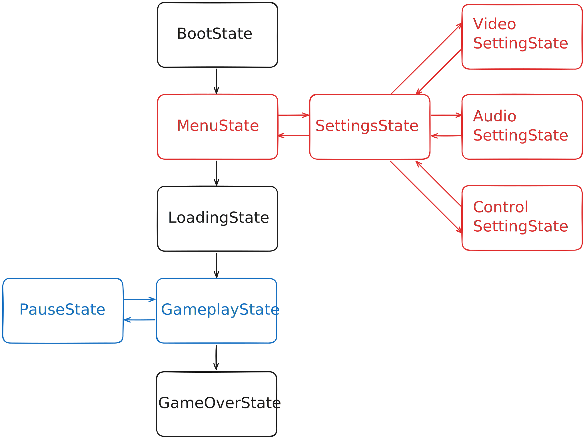
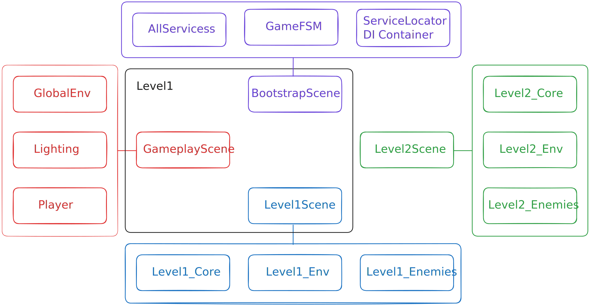

# Лучшие практики для создания улучшаемой, масштабируемой, оптимизированной, архитектуры игры

# About

**Добрый день читатель.**   
**Архитектура** создаваемой вами **игры** - творческое самовыражение программиста, проявление его фантазии, видения, вдохновения, 
как и любое другое творчество, принятие таких решений основано на опыте, базе, характере и чувственных восприятиях разработчика. 
Ниже описано **мое видение**, я не претендую на правду в последней инстанции, думаю никто, никогда ее не найдет, я хочу поделиться
своими наработками и услышать фидбек!

> [!WARNING]
> Репозиторий реализовывает эти практики с очень плохим неотполированным кодом, это все наброски, но они работают.
 
Данный репозиторий - это холст для обучения и экспериментов.

> [!IMPORTANT]
> Если у вас есть советы, предложения, возражения, дополнения пожалуйста напишите мне подскажите и исправьте, мне будет очень интересно послушать и лучше разобраться в этом вопросе.

# Bootstrap Scene

_**Bootstrap Scene - фундамент, корни будущей архитектуры, при поливе превращающиеся в цифровой сад готовых дизайнерских решений.**_

Наличие **Bootstrap Scene**, реализованной с помощью паттерна **Entry Point**, является ключевым элементом архитектуры проекта.
**Bootstrap Scene** загружается первой при старте приложения и остаётся активной на протяжении всей работы игры, 
функционируя как аддитивная базовая сцена, поверх которой загружаются остальные игровые уровни.

Её основная задача — инициализация, конфигурация и управление жизненным циклом всех базовых сервисов, необходимых для работы проекта. 
Например, в рамках **Bootstrap Scene** создаются и запускаются следующие подсистемы:
- **Core-сервисы**: SceneLoaderService, SaveLoadService, Logger, EventManager, GameStateMachine.
- **Gameplay-сервисы**: InputService, AudioService, UIService и другие, отвечающие за геймплейную логику.
- **Optional-сервисы**: аналитика, реклама, метрики, внутренняя отладка и т.п.

> [!NOTE]
> Выше представлены примеры подсистем и сервисов.

Такой подход решает одну из ключевых проблем крупной архитектуры Unity — отсутствие гарантированного порядка инициализации объектов, 
особенно при переходах между сценами. **Bootstrap Scene** обеспечивает строго контролируемый жизненный цикл сервисов 
и детерминированный порядок их запуска, что делает взаимодействие между компонентами прозрачным и предсказуемым.

Кроме того, использование **Bootstrap Scene** позволяет полностью разделить ответственность между слоями системы — геймплейными, 
инфраструктурными и вспомогательными. Это упрощает тестирование, повторное использование кода и поддержку проекта на 
протяжении всего его жизненного цикла.

> [!TIP]
> Если вы реализуйте SceneLoaderService по примеру ниже в разделе SceneLoaderService, **Bootstrap Scene** всегда будет запускаться первой, но если
> работайте по-другому стоит реализовать систему, которая будет запускать аддитивно Bootstrap самой первой сценой
> и только после ее загрузки запускать все остальное.

## Код первоначальной загрузки

Код снизу позволяет загружать **Bootstrap Scene**, перед любыми другими сценами и уровнями в игре.
Что создает так необходимую страховку, что все нужные сервисы загрузятся в правильном порядке

```C#
public static class GameBootstrap
{
public static string RequestedScene;

	[RuntimeInitializeOnLoadMethod(RuntimeInitializeLoadType.BeforeSceneLoad)]
	private static void OnGameStart()
	{
		string activeScene = SceneManager.GetActiveScene().name;

		if (activeScene != "BootstrapScene")
		{
			RequestedScene = activeScene;
			SceneManager.LoadScene("BootstrapScene");
		}
		else
		{
			RequestedScene = null;
		}
	}
}
```

# Services

**Сервисы** являются основой инфраструктуры проекта — они выполняют ключевые задачи, 
обеспечивая работу всей игры на уровне ядра и геймплея.
Практически в любом проекте Unity они присутствуют, независимо от жанра или масштаба. 
Однако важно не только то, какие сервисы используются, но и как они структурированы, инициализируются и взаимодействуют между собой,
и остальным кодом. Про инициализацию было сказано выше, это происходит в Bootstrap Scene, так же может быть сервис, который будет 
инициализироваться перед уровнем где он используется и выгружаться после его завершения.

## Подходы к внедрению сервисов

Существует несколько распространённых подходов к внедрению и управлению сервисами:

- **Singleton** - самый простой способ организации сервисов. Каждый сервис реализуется как синглтон, инициализуерется в Boostrap-сцене, 
может существовать как Monobehavior-объект, либо как C# класс.
- **ServiceLocator** - более гибкий способ, имеющий некоторую простоту Singleton и структурность, организованность DI.
Все сервисы регистрируются в ServiceLocator, расположенном в Bootstrap-сцене (в виде MonoBehaviour или отдельного статического объекта).
Service Locator можно инкапсулировать, чтобы ограничить область доступа и повысить читаемость, например будут отдельные локаторы для gameplay, core, debug
- **DI Container** - DI развитие идеи ServiceLocator, основанной на принципе инверсии контроля (Inversion of Control).
Если при использовании Service Locator объект сам запрашивает нужные зависимости, то в случае DI — зависимости "внедряются" извне (в конструктор, поля или методы). 
Это делает систему более гибкой, тестируемой и легко расширяемой. 
Можно реализовать свой DI, но так же есть удобные готовые решения для Unity:
  - Zenject
  - Reflex
  - VContainer

## Таблица с описанием плюсов и минусов разных подходов к реализации сервисов:

| Подход          | Преимущество  | Недостатки  |
|-----------------|---------------|-------------|
| Singleton       | Просто и быстро  | Трудно тестировать, плохая изоляция |
| Service Locator | Централизовано, меньше хаоса  | Глобальные зависимости |
| DI              | Тестируемо, гибко, масштабируемо  | Сложнее на старте |


## Примеры сервисов

Пример сервисов:

- **SceneLoaderService** — отвечает за загрузку и выгрузку сцен, управление асинхронными переходами и предварительной инициализацией контента. 
Часто работает в связке с системой Addressables или AssetBundles.
- **AudioService** — централизованное управление звуками и музыкой: воспроизведение, кэширование, изменение громкости, кроссфейды между треками, 3D-звук и эффекты.
- **InputService** — абстрагирует ввод от конкретных источников (клавиатура, геймпад, мобильные жесты). 
Позволяет легко адаптировать управление под разные платформы.
- **DebugService / DeveloperConsole** — инструменты для отладки, логирования и ввода консольных команд во время разработки.

# StateMachine

**State Machine** — невероятно полезный паттерн, который помогает выстроить чистую, 
прозрачную и управляемую архитектуру поведения объектов.

Он инкапсулирует логику каждого состояния в отдельном классе, чётко разделяет ответственность, 
изолирует переходы и выстраивает предсказуемый порядок выполнения кода.

## Виды StateMachine

Существует два основных типа:
- **Обычная State Machine** — простая последовательность состояний и переходов;  
- **Иерархическая** — поддерживает вложенные состояния и позволяет выстраивать более сложные структуры поведения; 

> [!TIP]
> Перед созданием StateMachine, стоит заранее проанализировать понадобиться ли иерархия,
чтобы не столкнуться в будущем с разросшимся количеством переходов.

## Подходы к организации переходов

Еще есть два варианта реализации переходов между состояниями:

1. **Локальные переходы внутри состояний**

Каждое состояние само определяет, при каких условиях оно завершает работу и в какое состояние нужно перейти.
То есть логика переходов инкапсулирована прямо в классе состояния.

``` C#
public class AttackState : IState
{
    private readonly Player _player;
    private readonly StateMachine _machine;

    public void Update()
    {
        if (_player.Health <= 0)
            _machine.Enter<DeathState>();

        if (_player.HasNoTarget)
            _machine.Enter<IdleState>();
    }
}
```

Данный подход может подойти для простых систем, в которых не так много состояний.

2. **Централизованные переходы (предикаты, правила, Transition Map)**

Все переходы описываются в одном месте — обычно в отдельном конфигурационном классе.
Состояния становятся “чистыми”: они только выполняют свою внутреннюю логику, а решение, когда и куда перейти, 
принимает внешний контроллер на основе набора условий (предикатов).

``` C#
machine.AddTransition(AttackState, IdleState, () => player.HasNoTarget);
machine.AddTransition(AnyState, DeathState, () => player.Health <= 0);
```

Такой подход прекрасно подойдет для больших, иерархических, масштабных систем, так как будет 
проще контролировать возрастающие количество переходов.

## Библиотеки

Для Unity присутствует множество библиотек с уже реализововаными машинами состояний,
но из всех, мне приглянулась [**UnityHFSM**](https://github.com/Inspiaaa/UnityHFSM). 
В ней понятный, структурированный, документированный код, поддержка иерархии и централизованных переходов,
множество различных переходов.

# GameStateMachine

**GameStateMachine** — это машина состояний, которая отвечает за текущее состояние самой игры в целом.

Как уже было сказано ранее, **State Machine** позволяет инкапсулировать логику в конкретные состояния и 
выстраивать чёткий порядок выполнения.
В контексте игры это особенно важно: нам нужно иметь полный контроль над тем, в каком состоянии 
находится игра, и разделить зоны ответственности между этапами — загрузкой, меню, геймплеем и т.д.

## Пример иерархии состояний

Набор состояний, которые будут содержаться в **GameStateMachine** зависит от конкретной игры, 
снизу показан простой пример иерархической **GameStateMachine**, в коде выше реализована подобная система.

- **BootState** - Инициализация игры (загрузка сервисов, систем, данных).
- **MenuState** - Главное меню (UI, настройки). 
  - **SettingsState** - Настройки (подсостояние MenuState).
    - **VideoSettingState** - Параметры графики.
    - **AudioSettingState** - Звук и громкость.
    - **ControlSettingState** - Управление и бинды.
- **LoadingState** - Загрузка сцены, ассетов или данных перед геймплеем.
- **GameplayState** - Основной процесс игры (управление персонажем, логика уровня).
  - **PauseState** - пауза, временная остановка геймплея с активным UI.
- **GameOverState** - завершение игры (экран победы или поражения).

## Диаграмма GameStateMachine

Ниже представлена диаграмма **GameStateMachine**



# SceneLoaderService

**SceneLoaderService** — это сервис, который отвечает за загрузку и выгрузку сцен в игре.
Он позволяет собирать уровни из нескольких сцен, управлять их жизненным циклом и обеспечивать контроль 
над тем, что и когда находится в памяти.  
Аддитивные сцены являются мощным инструментов и дают ряд следующих преимуществ:
- Полный контроль над тем что загружается и что выгружается;
- Меньшее потребление памяти и простая интеграция с Addressables;
- Обеспечивают детализацию для командной работы и позволяют избежать конфликтов слияния;
- Возможность динамически собирать уровни и тестировать отдельные их части.

## Алгоритм SceneLoaderService

Хороший **SceneLoaderService** — это **MonoBehaviour-сервис**, который находится в **BootstrapScene**, в него можно
добавить объекты сцен, например с помощью [**Eflatun.SceneReference**](https://github.com/starikcetin/Eflatun.SceneReference),
из набора сцен получается **уровень**, каждый сцена будет грузиться **асинхронно**, если требуется последовательная
загрузка некоторых сцен, сервис будет иметь такой функционал, тут же удобно подключить **Addressable** и 
оптимизировать загрузку и выгрузку всех уровней. Реализация возможности выбора **активной** сцены.
**Обязательно** стоит реализовать систему, которая позволит
запускать нужный **уровень** в данный момент в редакторе, это позволит обеспечить комфортный дебаг уровня. 
**Поддержка кэширования** и повторного использование общих сцен (например, UI или Lighting). 

> [!TIP]
> Отличный пример готового решения - [**Advanced Scene Manager**](https://assetstore.unity.com/packages/tools/utilities/advanced-scene-manager-174152?srsltid=AfmBOorbVN07VZpI_iMK8kcedA4OC3MseMa-Jm073xJnyZtUJhvk2hRj).
> Это ассет, который предоставляет гибкий, удобный и визуально удобный менеджер сцен.

## Пример уровня состоящего из аддитивных сцен

На **диаграмме** снизу можно увидеть упрощенный пример созданного уровня из сцен.  
У нас имеется 4 сцены с тремя объектами которые входят в эти сцены:
- **BoostrapScene**: AllServices, GameFSM, ServiceLocator / DI Container;
- **GameplayScene**: GlobalEnv, Lighting, Player;
- **Level1Scene**: Level1Core, Level1_Env, Level1_Enemies;
- **Level2Scene**: Level2Core, Level2_Env, Level2_Enemies;
- 
  

Видно, как набор сцен: **BoostrapScene**, **GameplayScene**, **Level1Scene**, превращаются в один **уровень** - **Level1**
все это работает с помощью аддитивность и грузится асинхронно, при переходе ко втором уровню, где вместо
**Level1Scene** будет **Level2Scene**, выгружается только **Level1Scene**, а все остальные сцены остаются.

> [!IMPORTANT]
> Название сцены **Level1Scene** и общий **Level1** это разные вещи, общий **Level1** - это набор сцен, 
> **Level1Scene** - сцена, которая содержит набор объектов.
 
## Особенности и полезные ссылки

Unity не позволяет активировать сцену в тот же кадр, в котором она была загружена — нужно подождать один кадр.
Решения и утилиты для этого можно найти здесь:  
[**SceneHelper_Kurtdekker**](https://gist.github.com/kurtdekker/862da3bc22ee13aff61a7606ece6fdd3)   
[**CallAfterDelay_Kurtdekker**](https://gist.github.com/kurtdekker/0da9a9721c15bd3af1d2ced0a367e24e)

> [!TIP]
> Информацию о работе, преимуществах, недостатках, услышать советы можно на форуме Unity, конкретно
> в этом [**топике**](https://discussions.unity.com/t/best-practices-for-communicating-between-scenes/1528964/18)
> **Kurt-Dekker** приводит огромное количество ссылок на свои работы на эту тему (**19 ответ**).


# Addressable

**Addressables** — это система управления ресурсами в Unity, которая позволяет загружать и выгружать ассеты по их адресу,
независимо от того, находятся ли они локально или на удалённом сервере (CDN).

Главная идея **Addressables** — дать полный контроль над памятью и загрузкой контента во время выполнения.
Каждый ресурс (сцена, префаб, текстура, звук) получает уникальный адрес, по которому его можно вызвать из любого места в проекте.

## Addressables + SceneLoaderService

И вот тут можно увидеть одно из преимуществ хорошо спроектированной архитектуры, пакет **Addressables** и **SceneLoaderService**
созданы друг для друга и лучше при реализации **SceneLoaderService**, задумываться о том как же приятно будет совместить
его с **Addressables**. Данная архитектура даст ту самую гибкость и оптимизации, которая нам так необходима.
В связке двух систем, ко всем преимуществам SceneLoaderService, добавляются преимущества **Addressables** и на выходе
получается ряд следующих плюсов:
- Уровни и сцены можно хранить как аддитивные адресные сцены, подгружаемые по запросу 
- Общие ассеты (например, Player, Lighting, UI) можно кешировать и переиспользовать без повторной загрузки
- При переходе между уровнями SceneLoaderService может выгружать старые **Addressables**, освобождая память

В результате получается система, где память всегда находится под контролем, а проект масштабируется без хаоса и утечек.

## Гибкость архитектуры под тип проекта

Важно понимать, что единого подхода к реализации связки **Addressables + SceneLoaderService** не существует - он всегда
зависит от проекта и его структуры.  
Например можно выделить два типа игра:
- **Линейные игры** - игры в которых уровни идут последовательно, друг за другом, в таком проекта будет использоваться
простая последовательная загрузка сцен. Здесь система может полностью выгружать предыдущий уровень перед загрузкой следующего,
сохраняя минимальный объём активных ассетов в памяти.
- **Игры с открытыми мирами** - в такой игре, сцены и ассеты подгружаются динамически, частями, 
в зависимости от положения игрока. В этом случае система должна оставлять часть сцен активными, 
чтобы избежать видимых подзагрузок. Как раз таки определить часть которая должна быть подгружена и является задачей художника.

Таким образом, **каждая игра нуждается в собственной реализации Addressables + SceneLoaderService** в зависимости
от задач и потребностей.

# EventSystem


# Взаимодействие систем

Выше были рассмотрены все ключевые компоненты архитектуры: 
Bootstrap Scene, сервисы, машины состояний, SceneLoaderService, Addressables и EventSystem, теперь хочу объяснить,
как эти системы будут взаимодействовать между собой. По моему мнению все должно работать, как единый механизм, системы
должны дополнять друг друга, а не нагружать архитектуру. 
Я опишу их работу как единый поток, начиная с инициализации и переходя к runtime-работе.

1. Все начинается с запуска **Bootstrap Scene**. Это фундамент, где инициализируется **GameStateMachine** и запускается состояние **BoostrapState**, 
создается **DI Container** или **ServiceLocator**, здесь регистрируются все core-сервисы(например, SceneLoaderService, 
SaveLoadService, EventManager) и gameplay-сервисы (InputService, AudioService). Если используется Singleton, сервисы просто 
инстанцируются здесь как MonoBehaviour или статические классы. DI-контейнер (например, Zenject) 
"внедряет" зависимости автоматически: SceneLoaderService получает ссылку на Addressables для асинхронной загрузки ассетов.


graph TD
A[Bootstrap Scene] -->|Загружается первой| B[Создаёт GameStateMachine]
B -->|Переходит в| C[BootState]
C -->|Инициализирует по порядку| D[Сервисы: Core, Gameplay, Optional]
D -->|Зависимости через DI/Locator| E[Переход в LoadingState]
E -->|Вызывает| F[SceneLoaderService + Addressables]
F -->|Загружает аддитивные сцены| G[GameplayState]
G -->|Делегирует через EventSystem| H[Локальные StateMachine (AI, Player)]
H -->|События и переходы| I[Переходы уровней: Выгрузка/Загрузка]
I -->|Финал| J[GameOverState: Cleanup]
style A fill:#f9f,stroke:#333
style D fill:#dfd,stroke:#333
style F fill:#ddf,stroke:#333


Я считаю, что стоит сразу реализовывать или пользоваться стейтмашиной с возможностью использования иерархии. 
Иерархия позволяет избежать дублирования, улучшает читаемость, 
можете попробовать создать два контроллера персонажа, который будет обладать большим количеством действий, 
без иерархии устанете прописывать переходы между всеми состояниями. Всегда можно заходить свою, 
но есть отличная уже сделанная со многими фишками  - Unity HFSM. Стейт машина отлично 
подходит для реализации главного героя, основного цикла игры, интерактивных объектов, AI, UI и так далее. 

https://github.com/Inspiaaa/UnityHFSM

Inspiaaa/UnityHFSM: A fast, tried-and-tested hierarchical finite state machine library for Unity, designed to be easy to use yet powerful without compromising performance.
